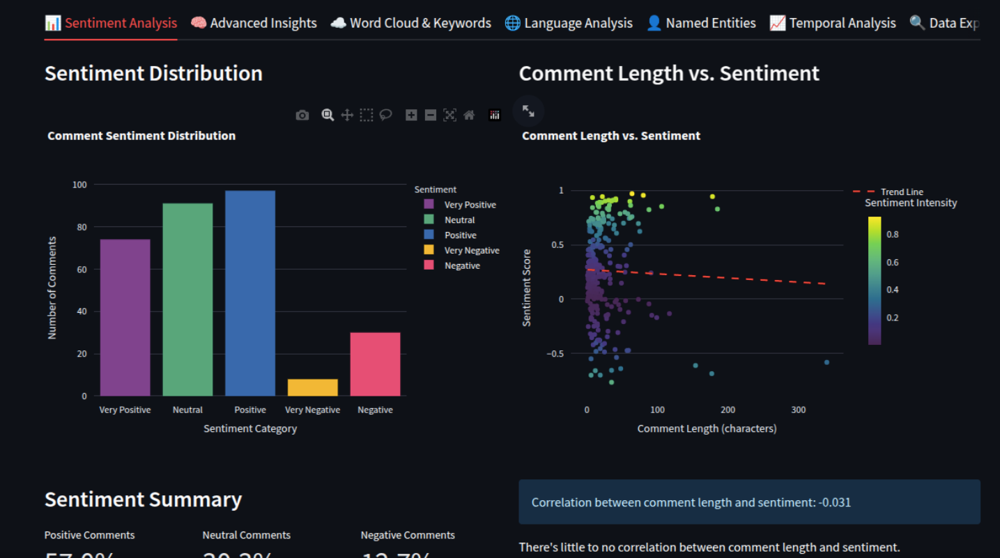

# YoutubeNLP
A Streamlit application for analyzing YouTube video comments using Natural Language Processing techniques.

## Screenshots

*Main Screen*


*Language Distribution*


*Sentimental Analysis*

## Features
- **YouTube Comment Analysis**: Automatically fetch and analyze comments from any YouTube video URL
- **Sentiment Analysis**: Evaluate the emotional tone of comments (positive, negative, or neutral)
- **Keyword Extraction**: Identify the most important words and topics in comments
- **Interactive Visualizations**:
  - Sentiment distribution chart
  - Comment length vs. sentiment scatter plot
  - Interactive word cloud with sentiment filtering
  - Top keywords bar chart
  - Sentiment over time analysis (when available)
  - Named entity recognition and analysis
  - Language detection and language-specific insights
- **Data Export**: Download all analysis results as CSV for further research

## Requirements
- Python 3.7+
- Required packages listed in `requirements.txt`
- Optional: Google Cloud Language API credentials for enhanced NLP capabilities

## Installation

1. Clone this repository:
```bash
git clone https://github.com/murapa96/YoutubeNLP.git
cd YoutubeNLP
```

2. Run the setup script to install dependencies and download required models:
```bash
python setup.py
```

This script will:
- Install required packages from `requirements.txt`
- Download the necessary spaCy model using `python -m spacy download en_core_web_sm`
- Download required NLTK resources
- Set up necessary directories
- Check for Google Cloud credentials

3. (Optional) Set up Google Cloud Language API for enhanced analysis:
   - Create a project in Google Cloud Console
   - Enable the Cloud Natural Language API
   - Create and download service account credentials
   - Set the environment variable: `export GOOGLE_APPLICATION_CREDENTIALS=/path/to/credentials.json`

## Usage

1. Run the Streamlit app:
```bash
streamlit run app.py
```

2. Open your browser at the URL provided in the terminal (usually http://localhost:8501)
3. Enter a YouTube video URL and click "Analyze Comments" 
4. Explore the interactive visualizations and insights

## Technical Information

- **Fallback Mechanisms**: Falls back to TextBlob for sentiment analysis if Google Cloud credentials aren't available
- **Multi-language Support**: Automatically detects language and applies appropriate analysis
- **Named Entity Recognition**: Identifies people, organizations, locations, and other entities in comments
- **Customizable**: Analysis options allow for comment count and sorting preferences
- **Efficient Processing**: Uses batched processing for better performance with large comment volumes

## Credits

Created by [Pablo Ramos Muras](https://github.com/murapa96)

## License

This project is licensed under the terms of the license included in the repository.

## Contributing

Contributions are welcome! Please feel free to submit a Pull Request.
